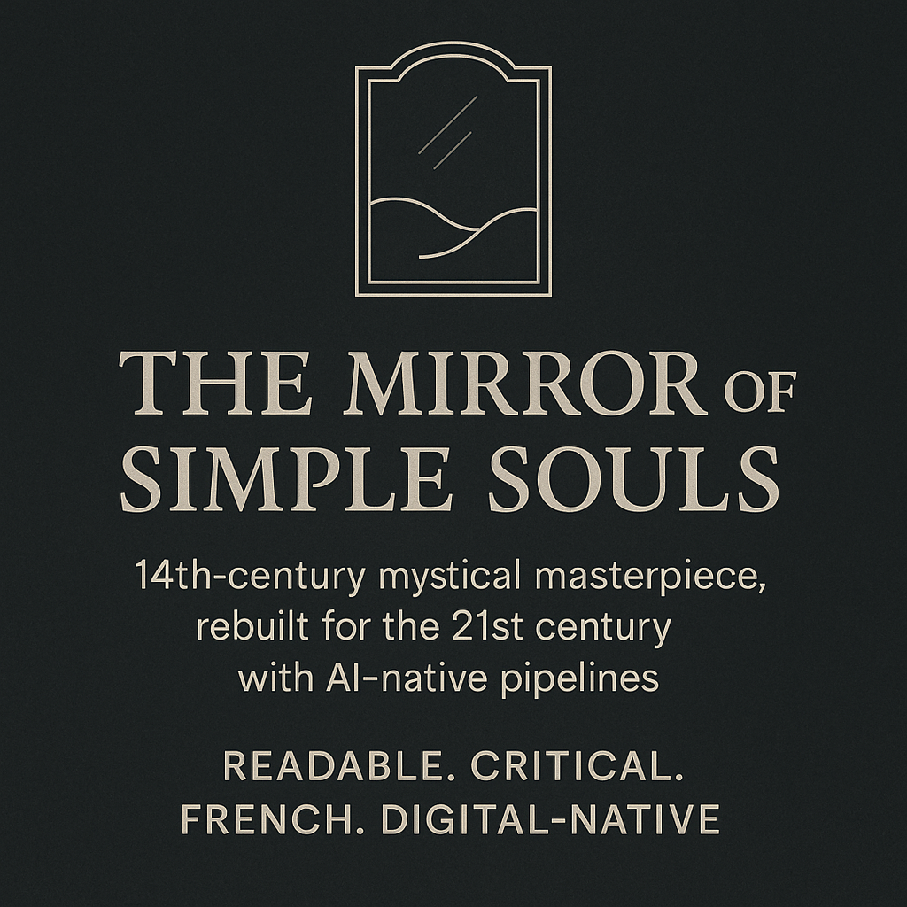

# 🪞 Mirror of Simple Souls — Living-Archive Edition  



**14th-century mystical masterpiece, rebuilt for the 21st century with AI-native pipelines**  
*Readable. Critical. French. Digital-native.*

---

## ✨ Overview

This is a **triple-format, AI-orchestrated Living Archive Edition** of *Le Mirouer des simples âmes anienties* (*The Mirror of Simple Souls*) — the poetic, theologically daring dialogue by Marguerite Porete that led to her execution in 1310.  

Inside this repository you’ll find:

- **Original Old French** — transcribed from public-domain sources.  
- **Readable English** — smooth, modern prose for contemporary readers.  
- **Critical English** — line-faithful, scholarly precision for researchers.  
- **JSON-LD format** — structured for linked data, digital humanities, and AI workflows.  

---

## 📦 JSON Structure

The heart of the project is:

```

Mirror-of-Simple-Souls\_Living-Archive-Edition\_v1\_FR-EN\_Zach-Banks.json

````

The structure follows a nested `Book → Chapter` model:

```jsonc
{
  "@context": "https://schema.org",
  "@type": "Book",
  "name": "Mirror of Simple Souls — Living-Archive Edition",
  "author": { "@type": "Person", "name": "Marguerite Porete" },
  "translator": [
    { "@type": "Person", "name": "Zach Banks" }
  ],
  "hasPart": [
    {
      "@type": "Chapter",
      "position": 1,
      "name": "Book I",
      "hasPart": [
        {
          "@type": "Chapter",
          "position": 1,
          "text_fr": "...",
          "text_en_readable": "...",
          "text_en_critical": "..."
        }
      ]
    }
  ]
}
````

* **`text_fr`** — Original Old French text
* **`text_en_readable`** — Modern, flowing English translation
* **`text_en_critical`** — Scholarly, literal English translation
* All entries contain stable metadata for citation, linked data, and AI integration.

---

## 🤖 AI Integration

This edition was created using a **custom AI orchestration pipeline**:

1. **Schema Design** — JSON-LD structure to encode bibliographic data + agent-to-agent (A2A) protocol hooks.
2. **Data Extraction** — Python script to scrape the Old French PDF into structured JSON.
3. **Dual Translation** — Automated via OpenAI’s GPT-4o with tuned prompts for:

   * *Readable*: modern, accessible English
   * *Critical*: faithful, scholarly English
4. **Comparative QA** — Side-by-side comparison with major existing editions (Babinsky, Kirchberger, Van Woerkom).
5. **Format Exports** — Markdown versions of each track for human-friendly reading.

---

## 📂 Repository Contents

```
.
├── LICENSE
├── mirror.png                   # Project image
├── mirror_original_fr.md        # Old French text
├── mirror_en_readable.md        # Readable English translation
├── mirror_en_critical.md        # Critical English translation
├── Mirror-of-Simple-Souls_Living-Archive-Edition_v1_FR-EN_Zach-Banks.json
└── README.md
```

---

## 🛠 How to Use

* Open the `.md` files for a human-readable version of each track.
* Load the `.json` file in a JSON viewer or process it via Python/JavaScript for structured analysis.
* Use it as:

  * A **parallel corpus** for translation study.
  * A **digital humanities dataset**.
  * A **testbed** for AI-based text retrieval and annotation.

---

## 📜 License

* **Text and translations**: [CC BY 4.0](https://creativecommons.org/licenses/by/4.0/) — free to share and adapt with attribution.
* **Code/scripts**: MIT License.

---

## ⚡ Author

**Zach Banks**
Construction foreman → AI pipeline builder → accidental medieval translator.

> *“If AI can help me create this, imagine what you can do with it.”*

---

## 📣 Spread the Word

* ⭐ Star the repo
* Share with medievalists, AI researchers, and digital humanists
* Fork and adapt for your own AI-driven literary projects

---

> 🪞 *The Mirror still speaks — now in a voice anyone can hear.*

